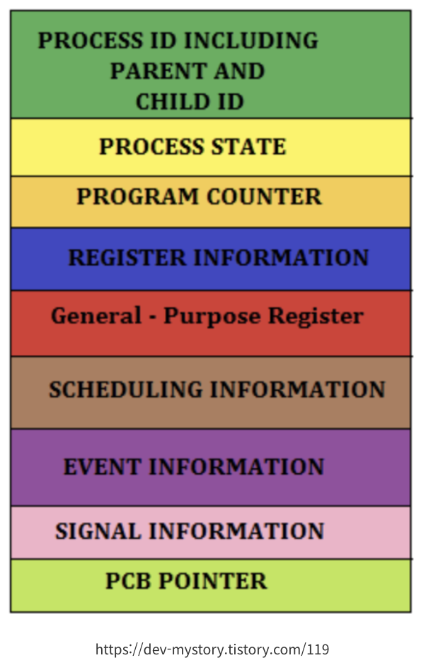

# 용어 정리

1. 이중모드
   - CPU에 직접적으로 응용 프로그램이 접근하면 자원이 무질서하게 관리될 것이고, 조금만 실수해도 컴퓨터 전체에 악영향이 가는데, 이 때, 운영체제가 응용 프로그램들이 자원에 직접 접근하는 것을 막고 자원의 효율적인 운영을 유지하는 등의 자원의 문지기 역할을 하는 구조를 구현하는 모드.
   - CPU는 명령어를 실행하는 모드를 크게 사용자 모드와 커널 모드로 구분.
   - 사용자 모드
      - 운영체제 서비스를 제공받을 수 없는 실행 모드. 즉, 커널 영역의 코드를 실행할 수 없는 모드.
      - 일반적인 응용 프로그램이 실행되는 모드.
   - 커널 모드
      - 운영체제 서비스를 제공받을 수 있는 실행 모드. 즉, 커널 영역의 코드를 실행할 수 있는 모드.
      - 운영체제가 실행되는 모드. 
2. 시스템 호출
   - 예를 들어, 사용자 모드로 실행되는 프로그램이 운영체제 서비스를 제공받으려면 운영체제에 요청을 보내 커널 모드로 전환되어야 하는데, 이러한 운영체제 서비스를 제공받기 위한 요청을 시스템 호출이라고 한다. 
   - 일종의 인터럽트. 정확하게는 소프트웨어 인터럽트.
   - 시스템 호출을 발생시키는 명령어가 실행되면
      - 1. CPU는 지금까지의 작업을 백업하고
      - 2. 커널 영역 내에 시스템 호출을 수행하는 코드를 실행한 뒤
      - 3. 다시 기존에 실행하던 응용 프로그램으로 복귀하여 실행을 계속해 나갑니다. 
3. 프로세스
   - 실행중인 프로그램
   - 기본적으로 1개의 CPU 당 1개의 프로세스를 실행하는데, 빠르게 전환해가는 것을 반복해서 동시에 실행되고 있는 것처럼 보이는 것.
4. 프로세스 동기화
5. 교착 상태
6. CPU 스케쥴링
7. 파일 시스템
8. 프로세스 제어 블록(PCB) 
   - 프로세스를 관리할 때 필요한 정보를 포함하는 운영체제 커널의 자료구조. 
   - 커널 영역에서 생성되며, 프로세스 생성 시에 만들어지고 실행이 끝나면 폐기된다. 
   - 주로 아래와 같은 정보가 담긴다.
      - 프로세스 ID(PID) : 프로세스를 식별하기 위한 고유 번호
      - 레지스터 값 : 실행 순서가 돌아오면 전에 사용했던 레지스터 값들이 필요
      - 프로세스 상태 : waiting 상태인지, running 상태인지 등
      - CPU 스케줄링 정보 : 프로세스가 언제, 어떤 순서로 CPU를 할당받을지에 대한 정보
      - 메모리 관리 정보 : 메모리의 주소값
   

   
   

9. IPC
   - 프로세스들끼리 서로 데이터를 주고받는 행위 또는 그에 대한 방법

10. 메모리 단편화

11. 페이징

12. Deadlock(교착상태)

13. 동기와 비동기

14. 뮤텍스와 세마포어

15. 기아(Starvation)

16. CPU 스케쥴링

17. 스와핑

18. 페이지 폴트