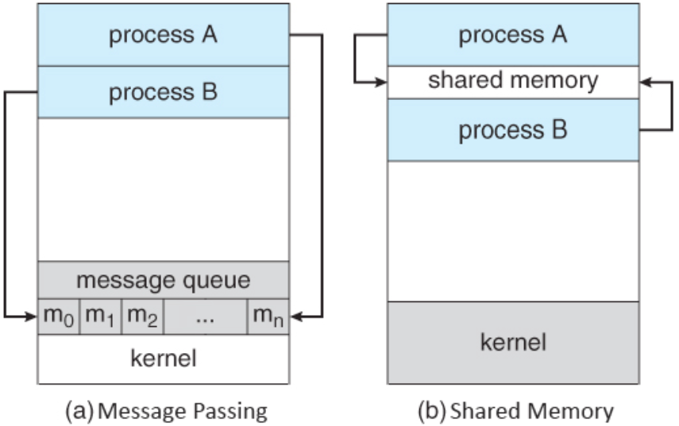

> **3. IPC란 무엇인가?**

<p align="center">

</p>

- 완전히 독립되어있는 프로세스들간의 통신방법입니다. 프로세스는 IPC 설비를 통해 서로 통신할 수 있습니다. 
- IPC의 종류는 아래와 같습니다.
    - 메시지 전달 (Message Passing)
        - 파이프(익명)
            - 공유 매개체는 '파일'이며, 부모 프로세스와 자식 프로세스 간 통신을 할 때 사용한다. 
            - 해당 방식의 목적은 fork() 를 사용하여 부모, 자식 프로세스를 만들어 각 프로세스를 각 코어에 동시 실행이 가능하게 하여 빠른 실행을 하기 위함으로, 즉 병렬 처리를 하여 빠른 프로그램 실행이 목적이다. 
            - 익명 PIPE는 하나의 프로세스는 데이터를 쓰기만, 다른 하나는 읽기만 가능하다. 그리고 한쪽 방향으로만 통신이 가능하기 때문에 Half-Duplex(반이중) 통신 이라고 부른다. (이는 PIPE두개를 사용해서 양방향으로 만들 수 있지만, 구현이 매우 복잡해질 수 있다.)
            - 통신을 할 프로세스가 뭔지 명확하게 알 수 있는 경우 사용한다.
            - 구현이 매우 간단하다는 장점이 있다.
        - Named Pipe
            - 익명 PIPE와는 다르게 부모 프로세스와 무관하게 전혀 다른 프로세스들 사이에서 통신이 가능하다.
            - 통신을 위해서 이름이 있는 파일들을 사용한다.
            - 익명 PIPE와 같이 단방향 통신만 가능하지만, 이름이 있는 파일 두개를 사용해서 이를 해결할 수는 있다.
        - 메시지 큐(Mesage Queue) 
            - 양방향 통신방식이다.
            - 공유 매개체는 '메모리'이다.
            - Named PIPE와 같은 입출력 방식을 사용 (FIFO) 하지만, Named PIPE는 데이터의 흐름이라면, 메시지큐는 '메모리 공간'이라는 차이가 존재한다.
            - 데이터를 주고받기 위한 '메시지 큐'를 커널에서 관리하는 방식이다.
            - 모든 프로세스에서 접근이 가능하다. (메시지큐의 접근자(식별자)를 아는 모든 프로세서는 동일한 메시지큐에 접근해서 데이터를 공유할 수 있다.)
        - 소켓 (TCP/IP)
            - 네트워크 소켓 통신을 통해 데이터를 공유한다.
            - 클라이언트와 서버가 소켓을 통해서 통신하는 구조로, 원격에서 프로세스간 데이터를 공유할 때 사용한다.
            - 로컬에서도 통신이 가능하며 원격에서도 통신이 가능하다. (IP : 127.0.0.1일 경우 로컬에서 패킷을 통해 프로세스끼리 통신하기도 한다.)
    - 메모리 공유 (Shared Memory)
        - 양방향 통신이며, 공유 매개체는 메모리이다.
        - 두 개 이상의 프로세스들이 주소공간의 일부를 공유하며, 공유한 메모리 영역에 읽기/쓰기를 통해 통신한다.
        - 공유 메모리가 설정되면, 그 이후 통신은 커널의 관여 없이 진행 가능하다.
        - 중개자 없이 곧바로 메모리에 접근할 수 있기 때문에 모든 IPC 중에서 가장 빠르게 작동한다. (커널에 관여가 없이 메모리에 직접 접근하기 때문에!)
        - 프로그램 레벨에서 통신기능을 제공하여 자유로운 통신이 가능하다.
        - 프로세스가 공유 메모리 할당을 커널에 요청하면, 커널은 해당 프로세스에 대한 메모리 공간을 할당해주고, 이후 모든 프로세스는 해당 메모리 영역에 접근할 수 있게 된다. (공유 메모리의 ID를 알면 누구나 해당 메모리에 접근 가능)

**3-1. 프로세스간 통신이 필요한 이유는?**
- 특정 테스크를 빨리 실행하고자 한다면 병렬처리가 필요합니다. 그렇다면 서로 데이터의 공유가 필요하고, 프로세스는 각자 독립된 메모리 공간을 가지기 때문에 서로의 데이터를 공유하는 도구가 필요할 것입니다.

<br>

> **11. 동시성 대응 문제는 어떻게 해결하는지**
- 우선, 동시성 문제란, 둘 이상의 프로세스나 스레드가 동시에 실행되면서 발생하는 문제들을 의미합니다. 동시성 문제는 여러 실행 흐름이 공유 데이터에 접근하거나 변경할 때 발생할 수 있는 문제들을 다룹니다.
- 아래와 같은 동시성 문제가 있을 수 있습니다. 
    - 경쟁 상태 (Race Condition): 둘 이상의 프로세스나 스레드가 공유 데이터에 동시에 접근하고, 적어도 하나의 접근이 쓰기 연산일 때 발생합니다. 이로 인해 예상치 못한 결과가 발생할 수 있습니다.
    - 교착 상태 (Deadlock): 둘 이상의 프로세스나 스레드가 서로 상대방의 자원을 기다리며 무한히 대기하는 상태를 말합니다. 이로 인해 시스템이 멈추거나 작업이 진행되지 않을 수 있습니다.
    - 데이터 무결성 손실: 여러 프로세스나 스레드가 동시에 공유 데이터를 변경하면서 발생할 수 있는 문제로, 예상치 못한 결과가 발생할 수 있습니다.
    - 순서 정합성 문제 (Ordering Problem): 다수의 프로세스나 스레드가 동시에 실행되면서, 실행 순서에 의존하는 문제가 발생할 수 있습니다. 이로 인해 일관성이 없는 결과가 발생할 수 있습니다.
- 그리고 이러한 문제들을 해결하기 위해, 다양한 알고리즘이 있으며, 대표적으로는 세마포어, 뮤텍스, 모니터 등이 있습니다.

**11-1. 공유자원과 임계영역이란 무엇인가?**

- 공유자원이란, 여러 프로세스가 공유하는 자원을 의미하며, 예를 들어, 전역변수, 파일, 입출력장치 등이 있습니다. 
- 임계영역이란, 동시에 실행하면 문제가 발생하는 자원에 접근하는 코드 영역을 의미합니다. 

**11-2. 세마포어 알고리즘이란 무엇인가?**

- 정수형 변수로, 상호 배제(mutex)와 같은 동작을 수행하지만 추가적으로 카운트 값을 가지고 있습니다.
- 세마포어는 두 개의 주요 연산을 지원합니다: wait과 signal. (+ `사용 가능한 공유자원의 갯수를 의미하는 전역변수 S`)
- wait: 세마포어 값을 감소시키고, 값이 0보다 작아지면 대기 상태로 전환합니다(임계구역에 들어가도 되는지 알려주는 함수).
- signal: 세마포어 값을 증가시키고, 대기 중인 프로세스나 스레드를 깨웁니다(이제 들어가도 괜찮다고 알려주는 함수).

```python
import threading

class Semaphore:
    def __init__(self, initial):
        self.value = initial
        self.mutex = threading.Lock()
        self.condition = threading.Condition(lock=self.mutex)

    def wait(self):
        with self.condition:
            while self.value <= 0:
                self.condition.wait()
            self.value -= 1

    def signal(self):
        with self.condition:
            self.value += 1
            self.condition.notify()

# 사용 예제
sem = Semaphore(initial=3)

def worker(sem, id):
    sem.wait()
    print(f"Thread {id} is working.")
    sem.signal()

threads = []
for i in range(5):
    t = threading.Thread(target=worker, args=(sem, i))
    threads.append(t)
    t.start()

for t in threads:
    t.join()
```

**11-3. 뮤텍스 알고리즘이란 무엇인가?**

- 뮤텍스는 상호 배제(mutex exclusion)를 구현하는 동기화 도구로, 임계 영역(critical section)에 대한 접근을 하나의 프로세스나 스레드에게만 허용합니다.
- 뮤텍스를 소유하고 있는 스레드만이 임계 영역에 접근할 수 있으며, 다른 스레드는 뮤텍스가 해제될 때까지 기다려야 합니다.
- 뮤텍스는 lock과 unlock 연산을 제공하여 임계 영역에 대한 동기화를 달성합니다. (+ `프로세스들이 공유하는 전역변수 lock`)
- 하지만, 계속에서 lock인지 확인해야 하기 때문에 바쁜 대기(busy waiting)문제가 있을 수 있다.

```python
import threading

class Mutex:
    def __init__(self):
        self.lock = threading.Lock()

    def acquire(self):
        self.lock.acquire()

    def release(self):
        self.lock.release()

# 사용 예제
mutex = Mutex()

def critical_section(mutex, id):
    mutex.acquire()
    print(f"Thread {id} is in the critical section.")
    mutex.release()

threads = []
for i in range(5):
    t = threading.Thread(target=critical_section, args=(mutex, i))
    threads.append(t)
    t.start()

for t in threads:
    t.join()
```

<br>

> **14.가상 메모리란 무엇인가?**

- 물리적 메모리보다 더 큰 프로그램이 실행될 수 있도록 컴퓨터 시스템에서 사용하는 메모리 관리 기법입니다.
- 운영체제는 가상 메모리 기법을 통해 프로그램의 논리 주소 영역에서 필요한 부분만 물리적 메모리에 적재하고, 직접적으로 필요하지 않은 메모리 공간은 디스크에 저장하게 됩니다.
- 우선, 가상 메모리는 논리 주소와 물리 주소를 분리하여 사용합니다. 프로세스는 가상 주소 공간에서 동작하며, 이를 운영체제가 물리 메모리에 매핑합니다. 가상 메모리 시스템에서는 주로 페이지 테이블이라는 자료구조를 사용하여 논리 주소를 물리 주소로 변환합니다. 이를 통해 실제로 필요한 부분만 메모리에 올리고, 필요 없는 부분은 저장 장치(일반적으로 하드 디스크)에 보관합니다. 또한, 필요 없는 페이지는 저장 장치로 스왑 아웃(저장)되고, 필요한 페이지는 다시 메모리로 스왑 인(로드)됩니다. 이를 통해 더 큰 프로세스를 실행할 수 있습니다.

**14-1. 논리 주소와 물리 주소란 무엇인가?**
- 운영체제에서의 논리 주소(Logical Address)와 물리 주소(Physical Address)는 메모리 관리에서 사용되는 두 가지 주소 개념입니다.
- 논리 주소 (Logical Address)는, 프로세스가 직접 참조하는 주소입니다. 프로세스는 자신만의 주소 공간을 가지며, 이 주소 공간은 0부터 시작하여 논리적으로 연속적인 주소들로 구성됩니다. 논리 주소는 메모리 상의 실제 물리 주소와 일치하지 않을 수 있습니다. 논리 주소는 프로세스가 메모리에 접근하기 위해 사용되며, 운영체제는 이 논리 주소를 물리 주소로 변환하여 실제 메모리 위치로 매핑합니다.
- 물리 주소 (Physical Address)는, 실제로 메모리에 저장된 데이터의 주소로, 논리 주소가 실제로 매핑되는 물리적인 주소를 나타냅니다. 물리 주소는 논리 주소와 일치하거나 일치하지 않을 수 있습니다. 운영체제는 논리 주소를 물리 주소로 변환하여 프로세스가 실제로 메모리에 저장된 데이터에 접근할 수 있도록 합니다.
- 간단히 말해, 논리 주소는 프로세스가 직접 참조하는 가상의 주소이고, 물리 주소는 이를 실제 메모리 위치로 매핑한 실제 주소입니다. 메모리 관리 단계에서 운영체제는 논리 주소와 물리 주소 간의 변환을 수행하여 프로세스가 메모리에 안전하게 접근할 수 있도록 합니다.

**14-1. 논리 주소를 물리 주소로 변환하는 방법은?**

- CPU가 메모리 참조를 실행할 때는 MMU(Memory Management Unit)라는 HW 장치를 이용해 해당 논리 주소를 실제 메인 메모리의 물리 주소로 변환하여 메모리 참조를 진행합니다.
- 만약, 페이징 기법을 사용하는 경우에는, `페이지 번호 + 변위(offset)` 로 이루어진 논리 주소를 MMU를 통해 `프레임 번호 + 변위(offset)`로 이루어진 물리 주소로 변환하여 접근합니다.

**14-2. 가상 메모리는 왜 필요한가?**

- 먼저, 메인 메모리를 효율적으로 사용할 수 있습니다. 가상 메모리 시스템에서는 각 프로그램이 사용하는 가상 주소 공간을 우선 디스크에 저장해두고, 그중에서 자주 사용되는 부분만 메인 메모리로 가져와서 사용됩니다.
- 다음으로, 메모리 관리를 단순화합니다. 가상 메모리 시스템에서는 각 프로세스가 완전히 동일한 포맷의 가상 주소 공간을 가집니다. 이것이 가능한 이유는 실제로 메모리 참조를 수행할 때는 가상 주소를 물리 주소로 변환하는 작업이 진행되기 때문입니다.
- 마지막으로, 메모리 보호 메커니즘을 단순화합니다. 가상 메모리 시스템에서는 다른 프로세스의 주소 공간이 접근하는 것을 쉽게 막을 수 있습니다.

**14-3. 연속 메모리 할당 기법이란?**

- 연속 메모리 할당은 프로세스가 연속적인 메모리 블록에 할당되는 기법입니다.
- 프로세스는 시작 주소에서 일정한 크기의 연속된 메모리 공간을 요구하며, 운영체제는 해당 요구를 수용하고 할당된 메모리 공간을 사용합니다.
- 이러한 할당은 단일 연속 블록이 아니라 여러 개의 연속된 블록으로 이루어질 수도 있습니다.
- 장점
    - 간편한 관리: 연속 메모리 할당은 메모리 공간이 연속적으로 할당되기 때문에 메모리 관리가 비교적 간단합니다.
    - 빠른 접근: 주소의 연속성으로 인해 프로세스가 메모리에 접근하는 데 걸리는 시간이 짧아집니다.
- 단점
    - 외부 단편화: 프로세스가 메모리에서 해제될 때 발생하는 외부 단편화로 인해 새로운 프로세스를 할당하는 데 필요한 연속된 메모리 공간을 찾기 어려울 수 있습니다.
    - 유연성 부족: 프로세스의 크기가 메모리에 할당된 공간보다 작을 경우에도 해당 공간 전체를 사용해야 하므로 메모리 낭비가 발생할 수 있습니다.

**14-4. 가상 메모리 기법에는 어떤 것이 있는가?**

- 연속 메모리 할당 기법으로는 메모리를 효율적으로 운영할 수 없기 때문에 고안된 방법들에는 페이징과 세그멘테이션 기법이 있습니다.
- 페이징
    - 페이징이란, 프로세스의 논리 주소 공간을 페이지라는 일정 단위로 자르고, 메모리의 물리 주소 공간을 프레임이라는 페이지와 동일한 일정한 단위로 자른 뒤, 페이지를 프레임에 할당하는 가상 메모리 관리 기법입니다.
    - 연속 메모리 할당 기법과는 다르게 페이지별로 메모리에 저장되어있는 주소가 다르면, CPU가 어떤 메모리 주소를 봐야하는지 모르기 때문에, 페이지 테이블이라는 걸 만들어서 페이지 번호와 프레임 번호를 짝지어두고, 프로세스는 메모리를 참조하기 전 이 페이징 테이블을 참조하여 메모리에 접근한다. 
    - 장점 
        - 논리 메모리는 물리 메모리에 저장될 때 연속되어 저장될 필요가 없고
        - 물리 메모리의 남는 프레임에 적절히 배치되기 때문에 외부 단편화가 생기지 않는다.
    - 단점
        - 내부 단편화 문제가 발생할 수 있다.
        - 페이지 단위를 작게하면 해결할 수 있지만, 페이지 매핑 과정이 복잡해져 오히려 비효율적이다.
- 세그멘테이션
    - 세그먼트는 가상 메모리를 서로 크기가 다른 논리적 단위로 분할한 것을 의미한다.
    - 세그먼테이션은 프로세스를 물리적 단위인 페이지가 아닌 논리적 단위인 세그먼트로 분할해서 메모리에 적재하는 방식이다.
    - 분할되는 블록의 크기만 차이가 있을 뿐, 그 외는 모두 페이징과 비슷하다. 
    - 장점
        - 내부 단편화 문제가 해소된다.
        - 보호와 공유 기능을 수행할 수 있다.
        - 프로그램의 중요한 부분과 중요하지 않은 부분을 분리하여 저장할 수 있고,
        - 같은 코드 영역은 한 번에 저장할 수 있다.
    - 단점
        - 외부 단편화 문제가 생길 수 있다.

**14-5. 외부 단편화와 내부 단편화란 무엇인가?**
- 외부 단편화 (External Fragmentation)란, 할당된 메모리 블록들 사이에 사용되지 않는 작은 조각들이 흩어져 있는 상태를 말합니다.주로, 프로세스들이 메모리에 할당되고 해제될 때, 메모리 공간이 연속적이지 않아서 발생할 수 있으며, 외부 단편화로 인해 새로운 프로세스를 할당하는 데 충분한 연속적인 메모리 공간을 찾기 어려워집니다.
- 내부 단편화 (Internal Fragmentation)란, 메모리 블록 내에서 할당된 공간보다 실제로 필요한 공간이 작은 경우 발생하는 낭비를 의미합니다.주로, 가변 크기의 할당 단위를 사용할 때 발생하며, 할당된 메모리 공간이 프로세스의 요구보다 크기가 클 때 내부 단편화가 발생합니다. 이러한 내부 단편화로 인해 메모리가 비효율적으로 사용되며, 실제로 필요한 메모리 양보다 많은 양이 할당되어 메모리 공간이 낭비됩니다.
- 외부 단편화는 주로 연속 메모리 할당에서 발생하며, 내부 단편화는 가변 크기의 할당 단위를 사용할 때 주로 나타납니다. 효과적인 메모리 관리를 위해서는 이러한 단편화를 최소화하거나 관리하는 방법을 사용해야 합니다.

<br>

> **21. OS별로 특징이 뭔지**
